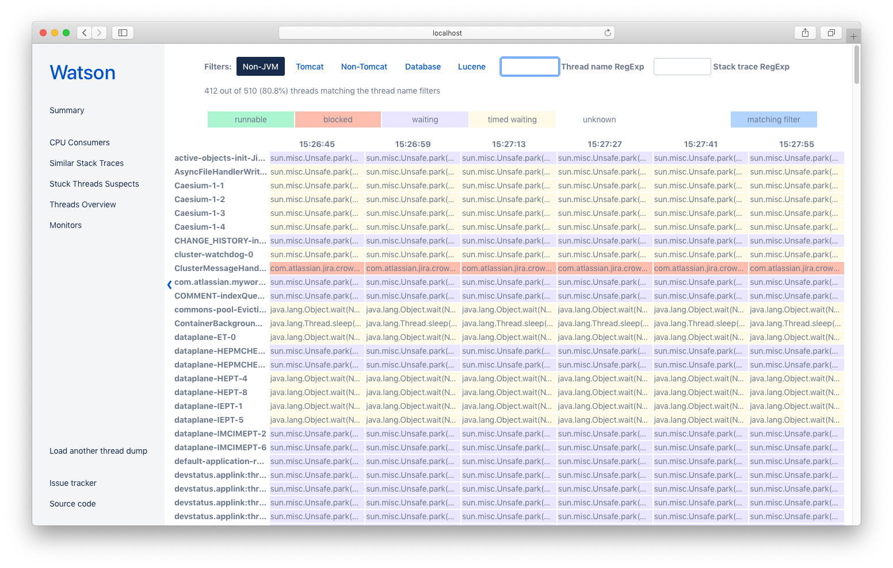

# Watson

Watson is a Jira-aware Java thread dump and CPU usage analyzer.

It combines the best features from other popular Java TDAs and removes a lot of noise, e.g. hides idle Tomcat threads waiting for work.



## Taking thread dumps
To fully laverage Watson, you should capture Java thread dump **and** top outputs.

The easiest way to do this is to use [Atlassian Support scripts](https://bitbucket.org/atlassianlabs/atlassian-support/src/master/).

## Environment setup

#### For mac
```
xcode-select --install
brew install gcc
brew install yarn
```

## Available scripts

In the root project directory, you can run:

### `yarn install`

Installs the required packages. Must be done prior to `yarn start`

### `yarn start`

Runs the app in the development mode.
Open [http://localhost:3000](http://localhost:3000) to view it in the browser.

The page will reload if you make edits.
You will also see any lint errors in the console.

### `yarn lint`

Runs `tslint` to check if coding rules are followed.

### `yarn test`

Launches the test runner in the interactive watch mode.

### `yarn build`

Builds the app for production to the `build` folder.
It correctly bundles React in production mode and optimizes the build for the best performance.
