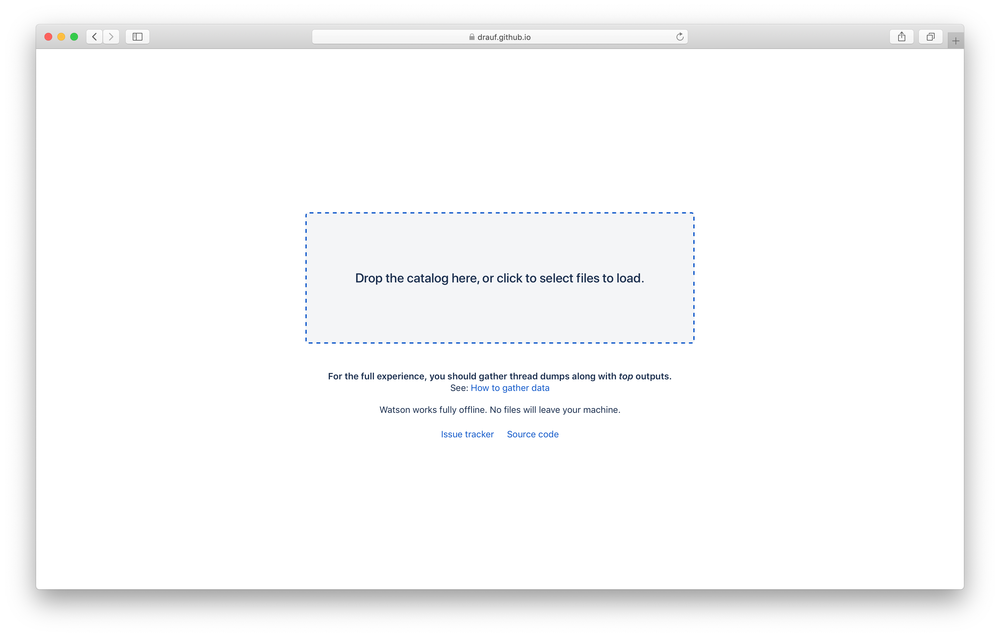
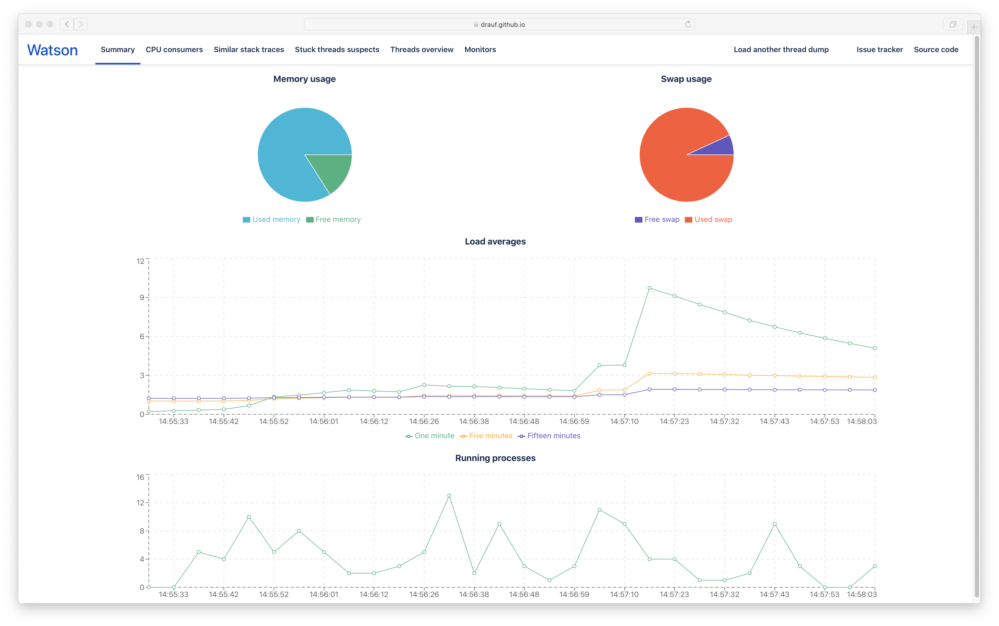
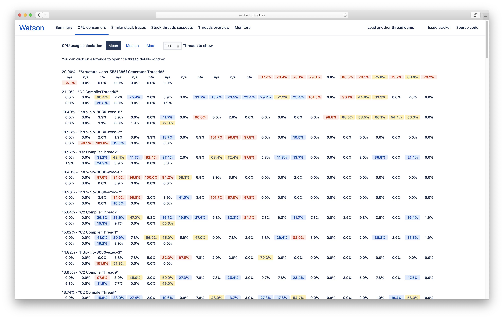
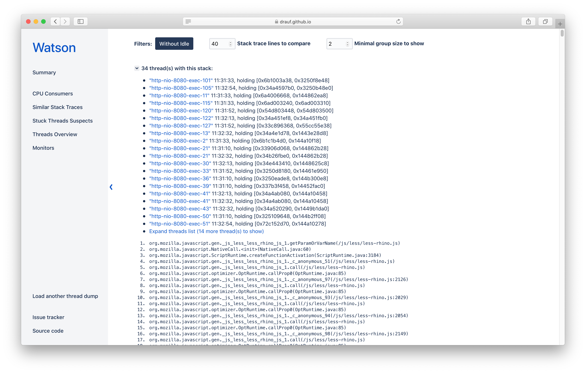
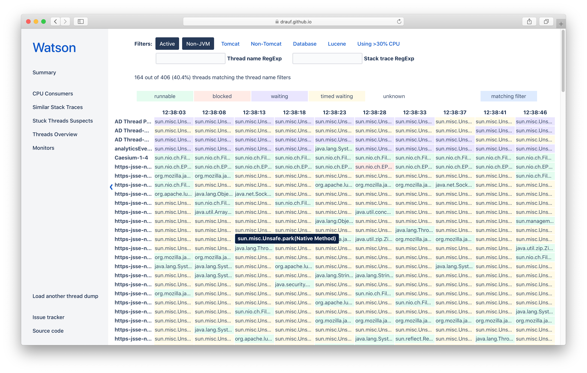

Watson is a Java thread dump and CPU usage analyzer.

It combines the best features of other popular Java TDAs and hides a lot of noise, like idle Tomcat threads waiting for work.

## Gathering thread dumps
To fully leverage Watson, you should capture Java thread dump **and** top outputs.

The easiest way to do this is to use [Atlassian Support scripts](https://bitbucket.org/atlassianlabs/atlassian-support/src/master/).

## Environment setup

You only need [yarn](https://classic.yarnpkg.com/en/docs/install/) installed on your machine.

## Available scripts

In the root project directory, you can run:

### `yarn install`

Installs the required packages. Must be done prior to `yarn start`

### `yarn start`

Runs the app in the development mode.
Open [http://localhost:3000](http://localhost:3000) to view it in the browser.

The page will reload if you make edits.
You will also see any lint errors in the console.

### `yarn lint`

Runs `tslint` to check if coding rules are followed.

### `yarn test`

Launches the test runner in the interactive watch mode.

### `yarn deploy`

Deploys the app to GitHub pages. Requires commit rights to the `gh-pages` branch.
