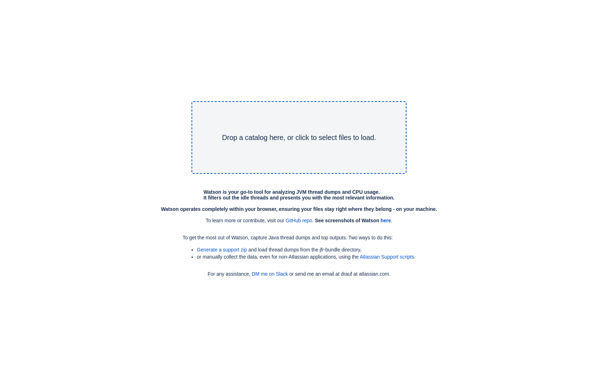
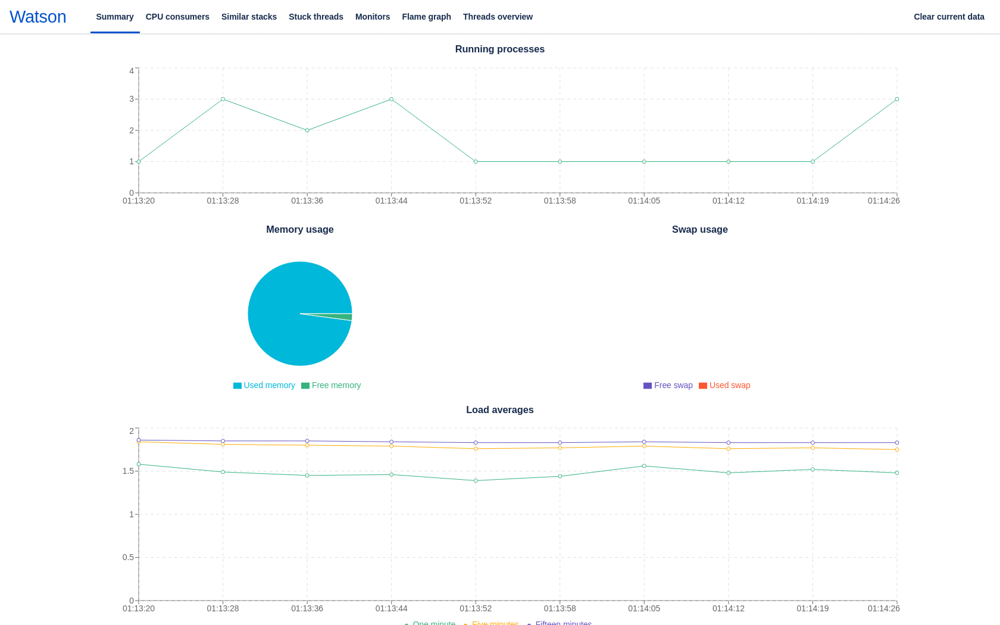
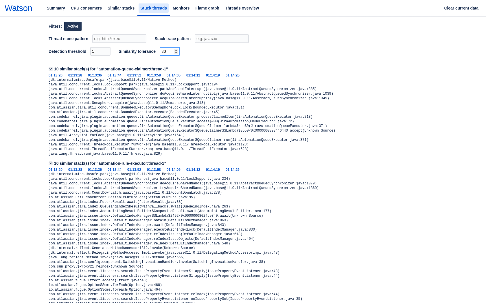
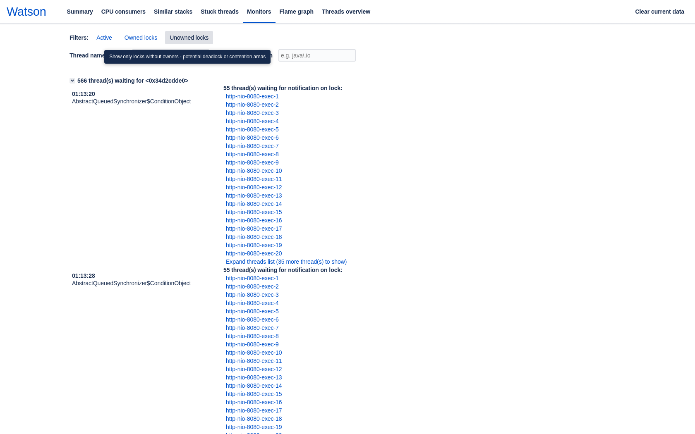

# Screenshots

## Home page

## Summary
Displays running processes, memory and swap usage, and load averages, based on top outputs.

## Threads overview
High-level overview of threads' state over time. Includes pre-built filters and allows manual filtering with regular expressions by thread names or stack frames. Very colorful to make it obvious when a thread changes states.

## Thread details
On most pages clicking a thread's name will open a pop-up like below. It includes colored stack frames to make it easier to notice JDK methods, database calls, Atlassian's and 3rd party code.

## Flame graph
A classical flame graph with the ability to zoom by clicking on a frame

## CPU consumers
Allows quickly finding threads that use the most CPU

## Similar stacks
Groups threads with similar stack traces, often helpful when debugging lock contention issues

## Stuck threads
Displays threads whose stack traces remained almost the same over time

## Monitors
Displays locks ordered by the amount of threads waiting for them

